# MLC Isometric 3D Heatmap Library

[Deutsche Version / German version](README.de.md)

A lightweight, reusable TypeScript library to render high-quality, interactive 3D isometric heatmaps as pure vector SVG graphics.

Unlike traditional 2D grid heatmaps, this library projects data points into isometric space using customizable 3D shapes (Prisms, Cylinders, and Continuous Ribbons), supporting load animations, diverging color schemes, negative sinking values, and transparent representation of null (missing) data.

---

## Why 3D Isometric?

Traditional 2D grid heatmaps rely **entirely on color gradients** to encode numeric values. While this works well on active digital displays, it introduces critical limitations in real-world scenarios:

1.  **Printing & Grayscale Conversion**: When reports or dashboards are printed in black-and-white or photocopied into grayscale, distinct color gradients often compress into virtually identical gray levels. This makes it extremely difficult to distinguish between different values on paper.
2.  **Colorblind Accessibility**: For users with color vision deficiencies (e.g., deuteranopia or protanopia), reading multi-hue color charts can be highly challenging.

By introducing **3D height and perspective**:
*   Values are double-encoded: by **color hue** and **physical column height**.
*   When printed in black-and-white or viewed in grayscale, the relative differences remain **instantly readable and distinguishable** thanks to the column heights.
*   Accessibility is greatly enhanced as the structural shape does not rely solely on color perception.

---

## Features

*   **Pure Vector Graphics (SVG)**: Renders directly as SVG code. Fully responsive, lightweight, scalable, and easy to embed or style.
*   **Multiple 3D Shapes**:
    *   `prism`: Sharp 3D rectangular columns.
    *   `cylinder`: Smooth 3D cylindrical pillars with shading gradients.
    *   `ribbon`: Continuous flowing 3D bands (curves) using cubic splines, with closed side-caps.
    *   `flatribbon`: Floating 3D ribbon bands of constant thickness.
    *   `mesh`: 3D contiguous surface mesh (terrain) with Lambertian diffuse shading.
*   **Model-View Separation**: Clean OOP coordinate space data model (`HeatmapGrid`) separate from the rendering engine.
*   **Flexible Axis Labels**: Automatic centering, alignment, and spacing of row/column labels with support for front/back positioning.
*   **Negative Values (Valleys & Trenches)**: Full projection support for negative heights sinking below the grid floor with diverging color themes.
*   **Null Value Concept**: Transparent/empty rendering for `null` cells, showing only grid floor lines, with smooth boundary slope-downs for continuous ribbons.
*   **Interactive Features**: Built-in CSS load animations (staggered delay transitions) and hover title/tooltip hooks.

---

## Installation & CDNs

### 1. Via npm
Install the library locally:

```bash
npm install mlc-isometric-heatmap
```

### 2. Via CDN (Browser Native ES Modules)
Load the rendering engine directly in modern browsers without build tools:

```html
<script type="module">
  import { HeatmapGrid } from 'https://unpkg.com/mlc-isometric-heatmap@1.0.0/dist/index.es.js';

  const grid = new HeatmapGrid(5, 5);
  // ...
</script>
```

### 3. Via CDN (Traditional UMD Globals)
Load scripts synchronously using standard HTML `<script>` tags:

```html
<!-- Core Visuals Renderer -->
<script src="https://unpkg.com/mlc-isometric-heatmap@1.0.0/dist/index.umd.js"></script>

<!-- Optional Calendar Aggregators -->
<script src="https://unpkg.com/mlc-isometric-heatmap@1.0.0/dist/presets.umd.js"></script>

<script>
  // Access elements on global window variables:
  const grid = new MlcIsometricHeatmap.HeatmapGrid(5, 5);
  const presets = MlcIsometricHeatmapPresets.presets;
</script>
```

---

## Getting Started

### 1. Basic Usage (OOP Grid Model)

The recommended approach is to use the `HeatmapGrid` class to define grid dimensions, insert data points (including `null` values), and render the SVG:

```typescript
// ES6 Module Import (Node/Bundlers):
import { HeatmapGrid } from 'mlc-isometric-heatmap';

// Or Browser-Native ES6 Module CDN Import:
// import { HeatmapGrid } from 'https://unpkg.com/mlc-isometric-heatmap@1.0.0/dist/index.es.js';

// Create an 8x8 coordinate grid
const grid = new HeatmapGrid(8, 8);

// Populate grid cells
grid.setCell(0, 0, 15, 'Monday morning activity');
grid.setCell(1, 1, -10, 'Tuesday dip');
grid.setCell(2, 2, null, 'No recorded data (renders transparent)');

// Set labels
grid.colLabels = ['C0', 'C1', 'C2', 'C3', 'C4', 'C5', 'C6', 'C7'];
grid.rowLabels = ['R0', 'R1', 'R2', 'R3', 'R4', 'R5', 'R6', 'R7'];

// Render to SVG string
const svg = grid.render({
  shape: 'prism',          // 'prism' | 'cylinder' | 'ribbon' | 'flatribbon'
  colorScheme: 'emerald',  // Preset theme name or custom color scheme object
  dark: false,             // Dark mode colors
  showGrid: true,          // Draw grid cell lines
  opacity: 1.0,            // Bar opacity (0.1 to 1.0)
});
```

### 2. Using Predefined Layout Aggregators

We provide built-in presets to automatically aggregate timeseries lists into calendar structures. Since these are optional, they are imported from a separate subpath:

```typescript
// ES6 Module Imports (Node/Bundlers):
import { renderHeatmap } from 'mlc-isometric-heatmap';
import { presets } from 'mlc-isometric-heatmap/presets';

// Or Browser-Native ES6 Module CDN Imports:
// import { renderHeatmap } from 'https://unpkg.com/mlc-isometric-heatmap@1.0.0/dist/index.es.js';
// import { presets } from 'https://unpkg.com/mlc-isometric-heatmap@1.0.0/dist/presets.es.js';

// 1. Weekly 24h Grid (24 columns x 7 days)
const events = [
  { timestamp: new Date('2026-06-09T10:15:00Z'), value: 5 },
  { timestamp: new Date('2026-06-09T15:30:00Z'), value: 20 }
];
const weeklyGrid = presets.aggregate24h(events, { startOfWeek: 1 });
const weeklySvg = weeklyGrid.render({ colorScheme: 'sky' });

// 2. Monthly Calendar Grid (5 columns of weeks x 7 days of week)
const monthlyGrid = presets.aggregateMonth(events, { year: 2026, month: 5 }); // June

// 3. GitHub Contribution Grid (53 columns of weeks x 7 days of week)
const yearlyGrid = presets.aggregateYear(events, { year: 2026 });
```

---

## Render Options

Configure the output by passing these settings to `.render()` or `renderHeatmap()`:

| Option | Type | Default | Description |
| :--- | :--- | :--- | :--- |
| `gridSize` | `number` | `16` | Cell spacing/size in pixels. |
| `gap` | `number` | `2` | Spacing gap between adjacent 3D columns. |
| `maxHeight` | `number` | `40` | Maximum height of a 3D bar (for max value) in pixels. |
| `colorScheme`| `string \| CustomColorScheme` | `'github'` | Presets: `'github'`, `'emerald'`, `'sky'`, `'coral'`, `'amber'`, `'purple'`, `'sunset'`, `'grayscale'`. |
| `dark` | `boolean` | `false` | Enable dark theme color schemes. |
| `shape` | `'prism' \| 'cylinder' \| 'ribbon' \| 'flatribbon' \| 'mesh'` | `'prism'` | Visual layout style. |
| `opacity` | `number` | `1.0` | Opacity value from `0.1` to `1.0`. |
| `showGrid` | `boolean` | `true` | Show isometric grid floor layout lines. |
| `zeroColor` | `string` | `undefined` | Override color of zero-value cells. |
| `renderFlatZero` | `boolean` | `true` | Renders a flat 2D plate for zero values instead of a blank space. |
| `interactive` | `boolean` | `true` | Embed interactive tooltips and hover scaling. |
| `animated` | `boolean` | `true` | Enables staggered load animations. |
| `projectionAngle` | `number` | `30` | Isometric camera angle in degrees (10° to 60°). |
| `labelPosition` | `'behind' \| 'front'` | `'behind'` | Render row/column labels at the back or front of the grid projection. |
| `showRowLabels` | `boolean` | `true` | Toggle visibility of row labels (series annotations). |
| `rowLabelStyle` | `RowLabelStyle` | `undefined` | Custom styling for row labels (colors, background boxes, padding, radius, font size). |

---

### RowLabelStyle Settings

Customize row/series text annotations using the `rowLabelStyle` configuration object:

*   `show?: boolean`: Easy toggle to turn off label rendering (default: `true`).
*   `fontSize?: number`: Font size in pixels (default: `9`).
*   `fontFamily?: string`: Custom font family (default: `'sans-serif'`).
*   `color?: string`: Font text color (default: theme default label color).
*   `backgroundColor?: string`: Backdrop rect fill color (e.g., `'#2f3542'`). If specified without a text `color`, a high-contrast text color is automatically resolved (white on dark backgrounds, slate on light backgrounds).
*   `backgroundOpacity?: number`: Opacity of the background box (default: `0.8`).
*   `padding?: number`: Padding spacing inside the background box (default: `4`).
*   `borderRadius?: number`: Corner border radius of the background box (default: `2`).

---


---

## Visual Examples

Here are some pre-rendered SVG examples demonstrating the library's capabilities:

*   **24h Timeline Gradient Demo (4 Shapes & Continuous Gradient)**:
    
*   **6-Month Split Timeline (Smooth Gradients)**:
    
*   **24h Double-Row Timeline**:
    *   
*   **3D Surface Mesh Terrain (Rolling Hills)** *(Note: The circular hole in the center represents a "lake" of intentional `null` values, demonstrating how missing/outage data is rendered as a clean gap in the terrain)*:
    *   

## AI-Assisted Development (Claude, Cursor, Antigravity)

This library includes a dedicated [skills.md](skills.md) file designed to help AI coding assistants (like Claude, Cursor, ChatGPT, or Antigravity/Agy) write clean, correct integration code.

### Quick Start Guide for AI Tools:
1.  **For Antigravity (Agy) / Claude**: Prompt the agent to look up the `skills.md` file first before generating code:
    > "Lies bitte die Datei `skills.md` im Projekt-Root-Verzeichnis, um das API-Design und die Code-Rezepte dieser Library zu verstehen."
2.  **For Cursor**: Reference the file directly in your chat panel or composer using `@skills.md` to feed the context to the model.
3.  **For Custom GPTs/Claude Projects**: Upload the `skills.md` file as part of the project knowledge base to get instant, highly accurate coding assistance.

---

## License & Attribution

This project is licensed under the terms of the **MIT License**.

Copyright (c) 2026 Michael Lechner

You are free to use, modify, and distribute this software, provided that the above copyright notice and this permission notice are included in all copies or substantial portions of the software. For more details, see the full [LICENSE](LICENSE) file.
