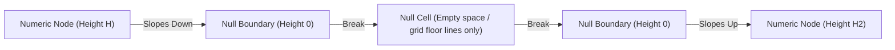

# Concept for Null Values in MLC Isometric Heatmap

This document presents the visual design concept and code implementation for handling `null` (missing or unrecorded data) values in the isometric 3D heatmap library.

---

## 1. Visual Design Philosophy

In data visualization, there is a fundamental difference between a **zero value** (data exists and is equal to 0) and a **null value** (data does not exist or is missing). Our 3D heatmap represents this distinction visually:

| Data Value Type | Rendering Behavior | Visual Representation |
| :--- | :--- | :--- |
| **Numeric Value (e.g. 10, -5)** | Renders as a 3D bar (prism, cylinder, or ribbon segment) corresponding to its height and magnitude. | Shaded 3D column rising/sinking above/below the floor. |
| **Zero Value (`0`)** | Renders using the `zeroColor` or theme's `empty` color (e.g., light gray/dark gray). | Flat 2D cell (or tiny flat slab) on the grid floor. |
| **Null Value (`null`)** | Renders as a **completely transparent/blank cell**. | Only the underlying grid floor lines are drawn; no 3D bar, no flat color fill, and no interactive tooltips are created. |

---

## 2. Special Case: Continuous 3D Ribbons

For continuous 3D ribbon charts, adjacent cells are connected to form a flowing band. When a cell contains a `null` value, the band must be **interrupted**.

To make this look professional rather than cutting off in mid-air:
- At the boundary of a `null` cell, the ribbon slopes down smoothly to height `0` (the grid floor).
- A **cap** is drawn on the sides of the ribbon segment next to the `null` cell to enclose the 3D volume.
- The band is completely broken at the `null` cell, resuming only when the next numerical cell is reached.



---

## 3. Code Implementation Detail

### Type Definitions ([src/data/types.ts](file:///mnt/data2tb/mlcheatmap/src/data/types.ts))
The `value` property of `HeatmapDataPoint` supports `null`:
```typescript
export interface HeatmapDataPoint {
  col: number;
  row: number;
  value: number | null;
  label?: string;
  color?: string;
}
```

### Grid Data Initialization ([src/data/grid.ts](file:///mnt/data2tb/mlcheatmap/src/data/grid.ts))
The OOP `HeatmapGrid` supports initializing and updating cell values with `number | null`:
```typescript
setCell(col: number, row: number, value: number | null, label?: string, color?: string): this;
```

### Renderer logic ([src/render/renderer.ts](file:///mnt/data2tb/mlcheatmap/src/render/renderer.ts))
1. **Min/Max Normalization**:
   We filter out `null` values when computing the absolute bounds to ensure they do not skew the height calculation:
   ```typescript
   if (p.value !== null) {
     if (p.value > maxValue) maxValue = p.value;
     if (p.value < minValue) minValue = p.value;
   }
   ```
2. **Height Bounds Tracking**:
   If a cell is `null`, its bar height bounds are ignored during viewBox calculation to prevent extra blank spaces:
   ```typescript
   if (pt.value === null) {
     continue;
   }
   ```
3. **Bar Drawing Loop**:
   In the main loops, grid lines are still generated (preserving the geometric skeleton), but the 3D geometries are skipped entirely:
   ```typescript
   const pt = getPoint(c, r);
   if (pt.value === null) {
     continue; // Skip rendering the 3D/2D shape, labels, or interactivity for this cell
   }
   ```

### Ribbon segment calculations ([src/render/ribbon.ts](file:///mnt/data2tb/mlcheatmap/src/render/ribbon.ts))
Adjacent grid locations check for `null` values and treat them as height `0` to build clean slope-downs and caps:
```typescript
const vPrev = c > 0 ? getPoint(c - 1, r).value : 0;
const vNext = c < cols - 1 ? getPoint(c + 1, r).value : 0;

const hPrev = vPrev === null ? 0 : vPrev;
const hNext = vNext === null ? 0 : vNext;
```
